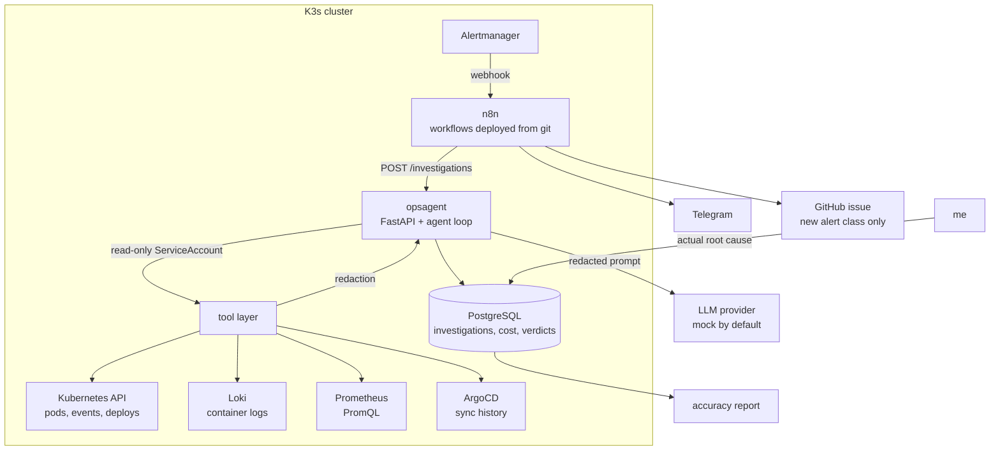

# ai-automation-lab

[](https://github.com/batpepe/ai-automation-lab/actions/workflows/ci.yml)


An incident triage agent that runs against my own K3s cluster. When Alertmanager
fires, it investigates using read-only access to the cluster's telemetry and
returns a ranked hypothesis a human can act on. Then it records whether it was
right.

That last part is the point. Piping an alert into a language model is a weekend
project. Measuring whether the output was correct, bounding what it costs, and
proving it cannot touch anything it should not, is the actual work.

This is the third lab in a series:
[devops-homelab-k3s-hybrid-cloud](https://github.com/batpepe/devops-homelab-k3s-hybrid-cloud)
is the platform it watches, and
[qa-engineering-lab](https://github.com/batpepe/qa-engineering-lab) is the test
suite that found six real defects in that platform.

## Architecture



Two properties are structural rather than conventional. Tool output passes
through redaction **before** it reaches the model, so nothing unredacted can
leave the cluster even if the agent misbehaves. And the model never executes
anything: it reads, it reasons, it proposes. Remediation is out of scope for v1.

## Status

Built phase by phase, and this table is the honest state of it.

| Phase | What it delivers | State |
|---|---|---|
| 0 | Repository skeleton, tooling, CI | Done |
| 1 | n8n as a GitOps workload, workflow export/import CLI | Tooling done, deploy pending |
| 2 | Cluster tool layer over MCP, redaction | Done |
| 3 | The agent: provider abstraction, guardrails, persistence | Planned |
| 4 | Alertmanager to Telegram, resolution capture | Planned |
| 5 | Metrics, Grafana dashboard, report page, runbook | Planned |
| 6 | Fault injection and the accuracy evaluation | Planned |
| 7 | Daily digest, manifest review bot, CVE triage | Planned |

The full breakdown, including the definition of done for each phase and the
parts of the brief I argued against, is in [plan.md](plan.md).

## Running it

Nothing here needs an API key, a database or cluster access. The default
provider is a deterministic mock, which is also what CI uses.

```bash
uv sync
uv run pytest
uv run opsagent show-config
```

```
environment=local
log_level=INFO
log_json=None
```

Quality gates, the same four CI runs:

```bash
uv run ruff check .
uv run mypy
uv run pytest
uv run opsagent n8n validate
```

Workflow sync needs a running instance and an API key, so it is the one thing
that does not work from a clean clone:

```bash
opsagent n8n export    # instance to git, produces a reviewable diff
opsagent n8n diff      # compare, exits non-zero on drift, used as a CI gate
opsagent n8n import    # git to instance, reconciles activation state
opsagent n8n validate  # offline checks, no API key needed
```

## Driving the tools by hand

The tool layer is an MCP server before it is an agent's dependency, so the tools
can be used from an editor session against the real cluster. Register it:

```json
{
  "mcpServers": {
    "opsagent": {
      "command": "uv",
      "args": ["run", "--directory", "/path/to/ai-automation-lab", "python", "-m", "opsagent.mcp"],
      "env": { "OPSAGENT_LOKI_URL": "http://localhost:3100" }
    }
  }
}
```

It reads whatever kubeconfig context is active, so point it at a read-only one.
The six tools are `get_pod_status`, `get_events`, `query_logs`, `query_metrics`,
`get_recent_deploys` and `get_runbook`. Every result carries how many values
were redacted and whether it was truncated, so a caller can never mistake a
partial answer for a complete one.

## Design decisions worth defending

**The repository runs with zero API keys and zero spend.** A reviewer who
clones this gets a working system, not a README describing one. That forced the
provider abstraction to exist from the start rather than being retrofitted.

**Redaction sits at the tool boundary, not before the prompt.** Putting it in
the agent means every future caller of the tool layer has to remember to redact.
Putting it in the tools means it is impossible to forget, and it is the most
heavily tested code in the repository.

**Redaction preserves identity instead of erasing it.** The same address always
becomes the same `<ip-1>`, so the model can still reason that the pod at
`<ip-1>` cannot reach `<ip-2>` and correlate that across a log excerpt and an
event. Masking everything to one `<redacted>` would destroy exactly the
structure a root cause is made of.

**The agent's ServiceAccount cannot read secrets and cannot write anything.**
The fault injection harness in phase 6 needs write access to break things on
purpose, so it carries its own separate credential. The agent never gets one.

**Log lines are untrusted input.** Anyone who can write to a log I read can
write instructions to my agent. That is in the threat model, and phase 6
measures what actually happens rather than assuming the prompt held.

## Documentation

| Document | What it covers |
|---|---|
| [plan.md](plan.md) | Phases, definitions of done, data model, open questions |
| docs/adr/ | Decisions and the alternatives rejected |
| docs/assumptions.md | Everything assumed rather than verified |
| docs/threat-model.md | Trust boundaries, RBAC scope, prompt injection |
| docs/cost-model.md | Token and cost accounting per investigation |
| docs/eval-report.md | Accuracy numbers, including the misses |

## Author

Kostiantyn Osmakov
[cv.batpepe.online](https://cv.batpepe.online) | [@batpepe](https://github.com/batpepe)
